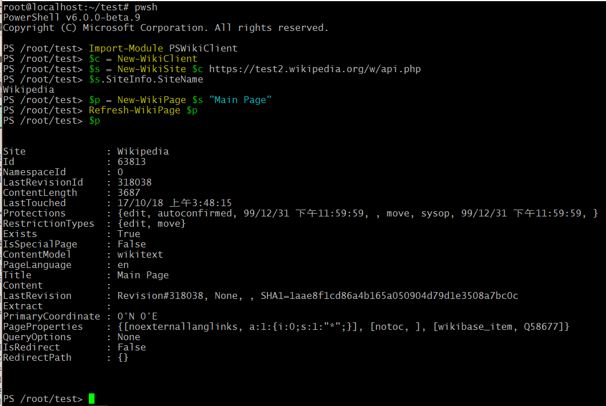

# PSWikiClient

Flavor [Wiki Client Library](https://github.com/CXuesong/WikiClientLibrary) with PowerShell. WIP.



```powershell
$client = New-WikiClient
$site = New-WikiSite $client https://test2.wikipedia.org/w/api.php
Login-WikiSite $site "UserName" ("password" | ConvertTo-SecureString -AsPlainText -Force)

$page = New-WikiPage $site Project:Sandbox
Refresh-WikiPage $page -Content -ResolveRedirects
$page.Content += "\n\nHello world!"
Update-WikiPage $page -Summary:"Test edit" -Minor

Logout-WikiSite $site
```

## Prerequisite

*   .NET Core 2.0 (on any OS) or .NET Framework 4.7.1 (on Windows)
*   PowerShell Core 6.0 (on any OS) or PowerShell 5.1 (on Windows)